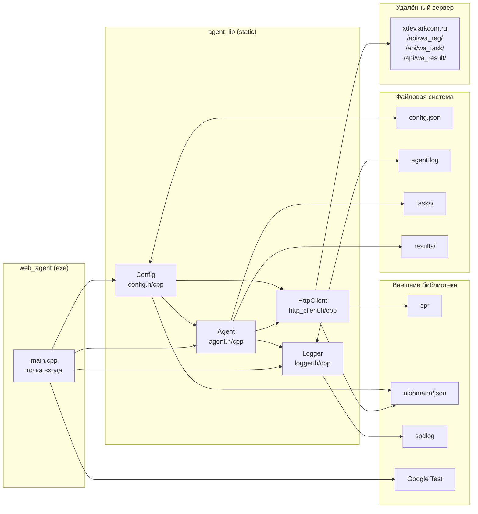
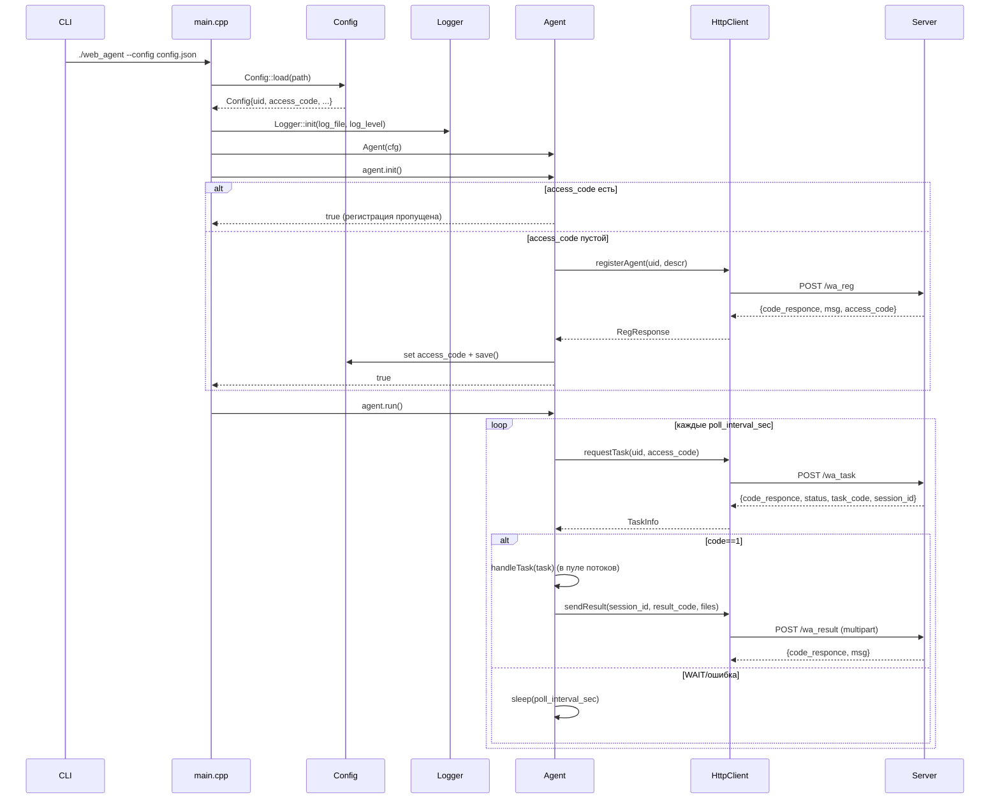

# Черновик архитектуры WEB-AGENT

**Статус:** обновлено после ЛР №1
**Версия:** 0.2 (22.03.2026)

---

## Обзор

WEB-AGENT — это кроссплатформенный сервис без пользовательского интерфейса. Процесс `web_agent` стартует единожды и управляет собственным жизненным циклом:

1. Загружает конфигурацию (`Config`), валидирует обязательные поля и, при необходимости, сохраняет выданный `access_code` обратно в `config.json`.
2. Поднимает логирование (`Logger`), чтобы все потоки писали в stdout и вращающийся файл `agent.log`.
3. Создаёт `Agent`, который инициализирует HTTP-клиент, регистрируется (или использует заранее сохранённый токен) и запускает цикл опроса сервера.
4. Все сетевые вызовы инкапсулированы в `HttpClient`, который уже умеет работать с JSON/multipart и предоставляет три операции: регистрация, запрос задания, отправка результата.

Архитектура плоская и модульная: каждый модуль реализован отдельной парой `*.h/*.cpp`, экспортируется через статическую библиотеку `agent_lib` и переиспользуется тестами. Процесс многопоточный: главный поток отвечает за инициализацию, отдельный поток — за опрос сервера, пул рабочих потоков выполняет задания (лимитируется `max_parallel_tasks`).

---

## Диаграмма компонентов



Стрелки отражают реальные зависимости: `main` использует `Config/Logger/Agent`, `Agent` делегирует запросы `HttpClient`, а тот опирается на cpr + nlohmann/json. Логгер замыкается на spdlog. Тесты (`wa_tests`) линкуются с `agent_lib`, поэтому `main` условно зависит от Google Test при сборке с `WA_BUILD_TESTS=ON`.

---

## Модули и текущий статус

| Модуль | Файлы | Ответственность | Статус (март 2026) |
|---|---|---|---|
| Config | `include/config.h`, `src/config.cpp` | Загрузка JSON, валидация, сохранение `access_code` в исходный файл | Реализован |
| Logger | `include/logger.h`, `src/logger.cpp` | Потокобезопасное логирование через spdlog (stdout + rotating file) | Реализован |
| HttpClient | `include/http_client.h`, `src/http_client.cpp` | POST `/wa_reg`, `/wa_task`, `/wa_result`, JSON/multipart, базовые таймауты | Реализован (без retry/backoff) |
| Agent | `include/agent.h`, `src/agent.cpp` | Регистрация, хранение `access_code`, запуск цикла опроса, делегирование задач | Частично (pollLoop/handleTask — заглушки) |
| main | `src/main.cpp` | CLI (`--config`, `--help`, `--version`), запуск агента | Реализован |
| Tests | `tests/*.cpp` | Проверка конфигурации, окружения и структуры репозитория | Реализовано для ЛР №1 |

---

## Поток выполнения (sequence)



---

## Потоки исполнения

```
Процесс web_agent
├─ Главный поток
│  ├─ Config::load → Logger::init → Agent::init
│  └─ Agent::run (ожидает завершения poll_thread)
├─ poll_thread (создаётся Agent::run)
│  ├─ requestTask → распознаёт код → ставит задания в очередь
│  └─ следит за остановкой (running_ = false) и таймаутом опроса
└─ task_worker[N] (до max_parallel_tasks)
   ├─ handleTask: подготовка окружения, запуск CMD/EXEC
   ├─ ожидание завершения процесса с таймаутом
   └─ сбор артефактов и вызов sendResult
```

При остановке `Agent::stop()` выставляет `running_ = false`, poll_thread корректно завершает цикл, дожидается всех worker'ов, и только после этого управление возвращается в `main`.

---

## План доработок (ЛР №2/№3)

1. **HttpClient**
   - реализовать retry с exponential backoff и настраиваемыми лимитами (`retry_count`, `retry_delay_sec`);
   - разделить таймауты (connect/request/upload) согласно NFR;
   - логировать тело ответа сервера при ошибках.
2. **Agent**
   - реализовать полноценный `pollLoop` со статусами WAIT/RUN/ERROR и поддержкой остановки по сигналу SIGINT/SIGTERM;
   - добавить пул потоков и очередь задач, ограниченную `max_parallel_tasks`;
   - реализовать `handleTask` для типов `CMD` и `EXEC`, включая захват stdout/stderr и подготовку `result_directory`.
3. **Результаты задач**
   - стандартизировать формат JSON в поле `result` (код, сообщение, список файлов);
   - автоматизировать сбор файлов из `result_directory` (маски, лимит размера);
   - обрабатывать ошибки загрузки (повторить, пометить статус ERROR, логировать).
4. **Тестирование**
   - покрыть `HttpClient` unit-тестами (mock-сервер);
   - добавить интеграционные сценарии для регистрации и цикла опроса;
   - расширить `RepositoryTest` проверкой новых артефактов (tasks/, results/, agent.log).
5. **Документация**
   - подготовить Doxygen-комментарии для публичных API;
   - описать структуру `options` и типов задач в отдельном документе;
   - синхронизировать README/TZ по мере реализации.

